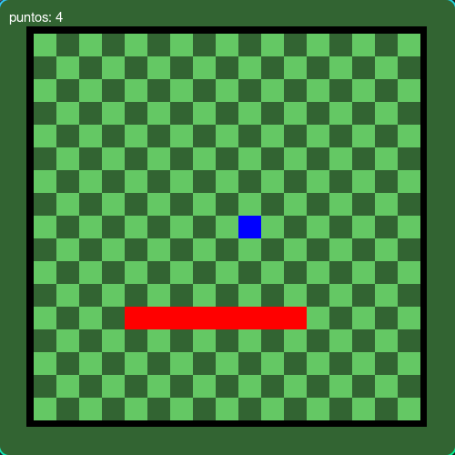
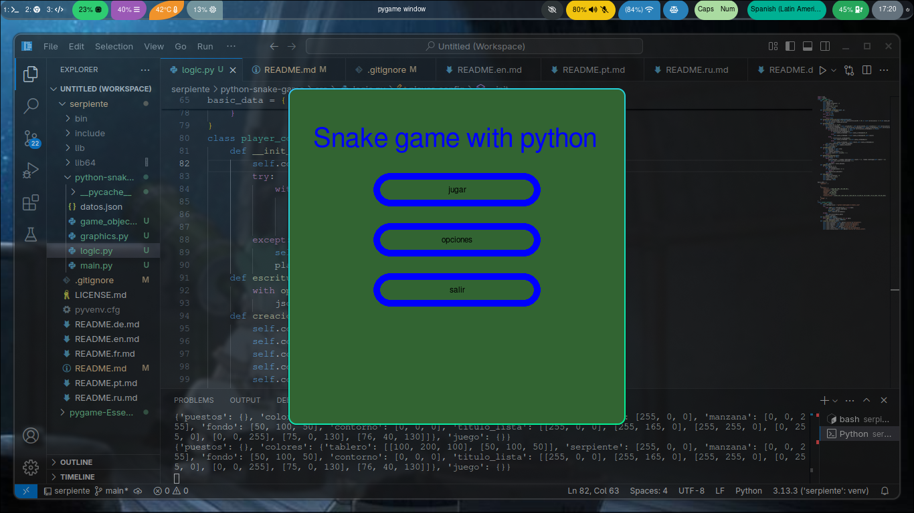
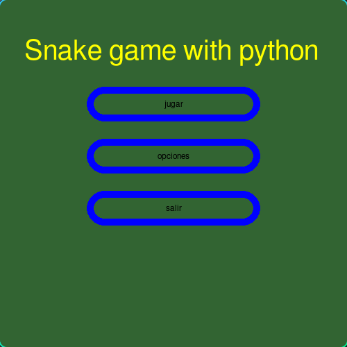
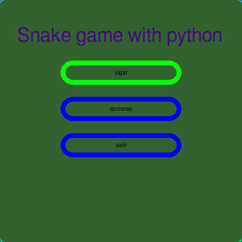
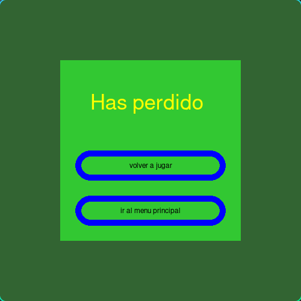

🌐 **Languages:** [Español](README.md) | [English](traducciones/README.en.md) | [Français](traducciones/README.fr.md) | [Português](traducciones/README.pt.md) | [Русский](traducciones/README.ru.md) | [Deutsch](traducciones/README.de.md)
---
# Snake python game

¡Recreación del famoso videojuego Snake usando python y pygame!

---
##   Estado del proyecto
* Proyecto en casi terminado, usable y con futuras versiones
## 🎮 Características

* Movimiento con awsd o en su defecto con las flechas del teclado.
* generacion de objetos de forma aleatoria.
* interfaz grafica.

## 🚀 Cómo jugar

1.  Asegúrate de tener el interprete de Python instalado.
2.  Asegurate de tener instalado la libreria pygame con `pip list` o `pip3 list`.
3.  En el caso de que no tengas pygame ejecutar `pip install pygame` o `pip3 install pygame` 
4.  descarga los archivos del juego: \
    para descargar unicamente los archivos del juego descarga el siguiente .zip y descomprimelo:
    https://downgit.github.io/#/home?url=https://github.com/manuelff2010/python-snake-game/tree/main/python-snake-game/ 
    
    descargar todo el repositorio(mas pesado): \
    `git clone https://github.com/manuelff2010/python-snake-game.git` 
5.  Abre una terminal(para windows `windows+r`, escribir `cmd` y pulsar enter)
6.  Navega a la carpeta del proyecto: `cd python-snake-game`
7.  Ejecuta el juego: `python main.py`

## 🛠️ Tecnologías utilizadas
* **Python**
* **pygame**
---
## 📸 Demo

---
## 💡 Próximos pasos

* Añadir configuraciones.
* Mejorar los gráficos.
* permitir graficos importados
---

## 📄 Licencia

Este proyecto está bajo la Licencia GPL-3.0.