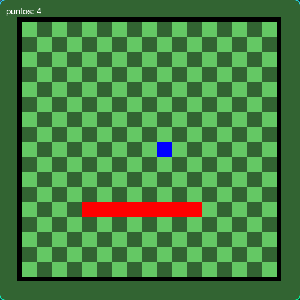
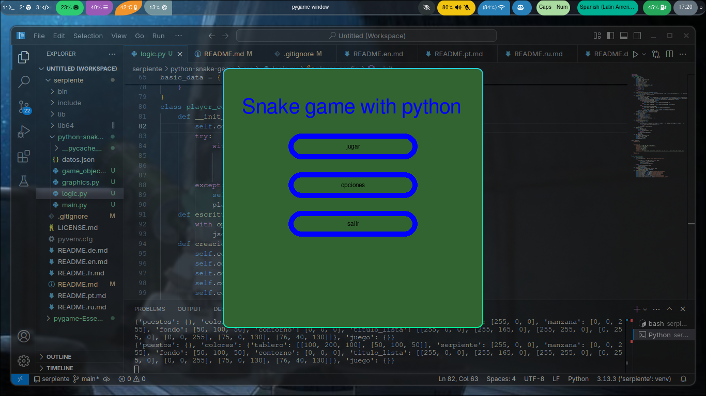

🌐 **Languages:** [Español](../README.md) | [English](README.en.md) | [Français](README.fr.md) | [Português](README.pt.md) | [Русский](README.ru.md) | [Deutsch](README.de.md)
---
# Snake Python Spiel

Neuauflage des berühmten Videospiels Snake mit Python und Pygame!

---
## Projektstatus
* Projekt fast fertiggestellt, nutzbar und mit zukünftigen Versionen.
## 🎮 Funktionen

* Bewegung mit WASD oder alternativ mit den Pfeiltasten der Tastatur.
* Zufällige Objekterzeugung.
* Grafische Benutzeroberfläche.

## 🚀 Spielanleitung

1. Stellen Sie sicher, dass der Python-Interpreter installiert ist.
2. Stellen Sie sicher, dass die Pygame-Bibliothek mit `pip list` oder `pip3 list` installiert ist.
3. Falls Sie Pygame nicht haben, führen Sie `pip install pygame` oder `pip3 install pygame` aus.
4. Laden Sie die Spieldateien herunter:
   Um nur die Spieldateien herunterzuladen, laden Sie die folgende .zip-Datei herunter und entpacken Sie sie:
   https://downgit.github.io/#/home?url=https://github.com/manuelff2010/python-snake-game/tree/main/python-snake-game

   Gesamtes Repository herunterladen (schwerer):
   `git clone https://github.com/manuelff2010/python-snake-game.git`
5. Öffnen Sie ein Terminal (für Windows `windows+r`, geben Sie `cmd` ein und drücken Sie Enter).
6. Navigieren Sie zum Projektordner: `cd python-snake-game/src`
7. Führen Sie das Spiel aus: `python main.py`

## 🛠️ Verwendete Technologien
* **Python**
* **pygame**
---
## 📸 Demo

---
## 💡 Nächste Schritte

* Konfigurationen hinzufügen.
* Grafiken verbessern.
* Importierte Grafiken zulassen.
---

## 📄 Lizenz

Dieses Projekt steht unter der GPL-3.0-Lizenz.