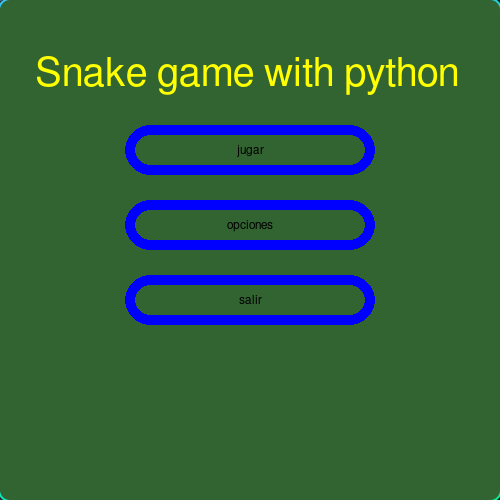

🌐 **Languages:** [Español](../README.md) | [English](README.en.md) | [Français](README.fr.md) | [Português](README.pt.md) | [Русский](README.ru.md) | [Deutsch](README.de.md)
---
# Snake python game

Recreation of the famous Snake video game using Python and Pygame!

---
## Project Status
* Project almost finished, usable and with future versions.
## 🎮 Features

* Movement with WASD or, failing that, with the keyboard arrows.
* Random object generation.
* Graphical interface.

## 🚀 How to play

1. Make sure you have the Python interpreter installed.
2. Make sure you have the pygame library installed with `pip list` or `pip3 list`.
3. If you don't have pygame, run `pip install pygame` or `pip3 install pygame`.
4. Download the game files:
   To download only the game files, download and unzip the following .zip:
   https://downgit.github.io/#/home?url=https://github.com/manuelff2010/python-snake-game/tree/main/python-snake-game/

   Download the entire repository (heavier):
   `git clone https://github.com/manuelff2010/python-snake-game.git`
5. Open a terminal (for Windows `windows+r`, type `cmd` and press enter)
6. Navigate to the project folder: `cd python-snake-game`
7. Run the game: `python main.py`

## 🛠️ Technologies used
* **Python**
* **pygame**
---
## 📸 Demo

---
## 💡 Next steps

* Add configurations.
* Improve graphics.
* Allow imported graphics.
---

## 📄 License

This project is under the GPL-3.0 License.
