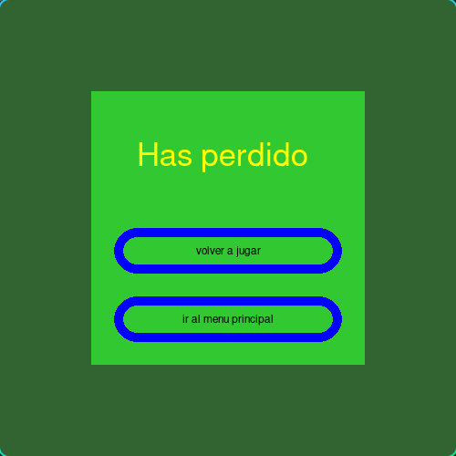

🌐 **Languages:** [Español](../README.md) | [English](README.en.md) | [Français](README.fr.md) | [Português](README.pt.md) | [Русский](README.ru.md) | [Deutsch](README.de.md)
---
# Jeu Python Snake

Recréation du célèbre jeu vidéo Snake utilisant Python et Pygame !

---
## État du projet
* Projet presque terminé, utilisable et avec de futures versions.
## 🎮 Fonctionnalités

* Mouvement avec ZQSD (ou WASD) ou, à défaut, avec les flèches du clavier.
* Génération d'objets aléatoires.
* Interface graphique.

## 🚀 Comment jouer

1. Assurez-vous d'avoir l'interpréteur Python installé.
2. Assurez-vous d'avoir la bibliothèque pygame installée avec `pip list` ou `pip3 list`.
3. Si vous n'avez pas pygame, exécutez `pip install pygame` ou `pip3 install pygame`.
4. Téléchargez les fichiers du jeu :
   Pour télécharger uniquement les fichiers du jeu, téléchargez et dézippez le .zip suivant :
   https://downgit.github.io/#/home?url=https://github.com/manuelff2010/python-snake-game/tree/main/python-snake-game/

   Téléchargez tout le dépôt (plus lourd) :
   `git clone https://github.com/manuelff2010/python-snake-game.git`
5. Ouvrez un terminal (pour Windows `windows+r`, tapez `cmd` et appuyez sur Entrée).
6. Naviguez jusqu'au dossier du projet : `cd python-snake-game`
7. Exécutez le jeu : `python main.py`

## 🛠️ Technologies utilisées
* **Python**
* **pygame**
---
## 📸 Démo

---
## 💡 Prochaines étapes

* Ajouter des configurations.
* Améliorer les graphiques.
* Permettre les graphiques importés.
---

## 📄 Licence

Ce projet est sous la licence GPL-3.0.