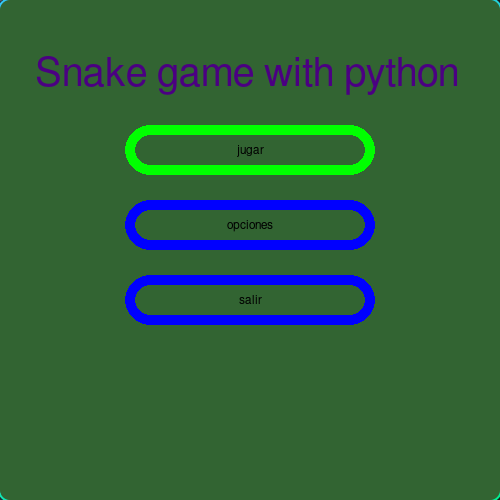

🌐 **Languages:** [Español](../README.md) | [English](README.en.md) | [Français](README.fr.md) | [Português](README.pt.md) | [Русский](README.ru.md) | [Deutsch](README.de.md)
---
# Jogo Snake Python

Recriação do famoso videogame Snake usando Python e Pygame!

---
## Status do Projeto
* Projeto quase finalizado, utilizável e com futuras versões.
## 🎮 Características

* Movimento com awsd ou, em alternativa, com as setas do teclado.
* Geração aleatória de objetos.
* Interface gráfica.

## 🚀 Como jogar

1. Certifique-se de ter o interpretador Python instalado.
2. Certifique-se de ter a biblioteca pygame instalada com `pip list` ou `pip3 list`.
3. Caso não tenha o pygame, execute `pip install pygame` ou `pip3 install pygame`.
4. Baixe os arquivos do jogo:
   Para baixar apenas os arquivos do jogo, baixe e descompacte o seguinte .zip:
   https://downgit.github.io/#/home?url=https://github.com/manuelff2010/python-snake-game/tree/main/python-snake-game/

   Baixar todo o repositório (mais pesado):
   `git clone https://github.com/manuelff2010/python-snake-game.git`
5. Abra um terminal (para Windows `windows+r`, digite `cmd` e pressione Enter).
6. Navegue até a pasta do projeto: `cd python-snake-game`
7. Execute o jogo: `python main.py`

## 🛠️ Tecnologias utilizadas
* **Python**
* **pygame**
---
## 📸 Demonstração

---
## 💡 Próximos passos

* Adicionar configurações.
* Melhorar os gráficos.
* Permitir gráficos importados.
---

## 📄 Licença

Este projeto está sob a Licença GPL-3.0.